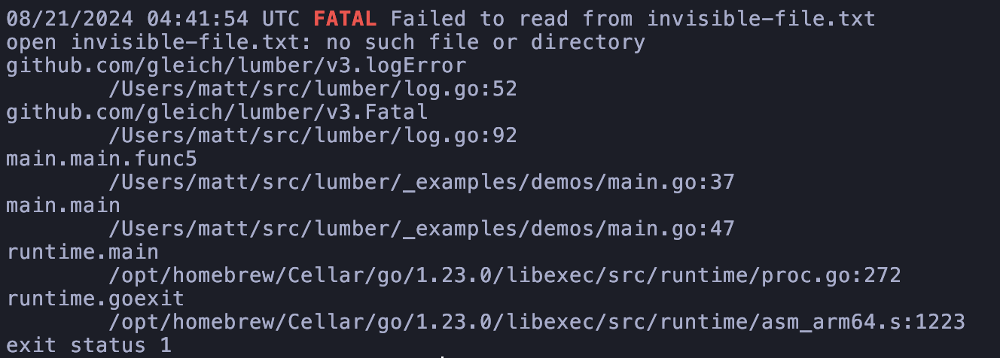

<!-- DO NOT REMOVE - contributor_list:data:start:["gleich", "ImgBotApp"]:end -->

<div align="center">
    <h1>🪵 lumber 🪵</h1>
    <a href="https://pkg.go.dev/github.com/gleich/lumber/v2"></a>
    
    
    <br/>
    
    
    <br/>
    <br/>
    <i>A dead simple, pretty, and feature-rich logger for golang</i>
</div>
<hr>

- [🚀 Install](#-install)
- [🌲 Logging Functions](#-logging-functions)
  - [`lumber.Success()`](#lumbersuccess)
  - [`lumber.Info()`](#lumberinfo)
  - [`lumber.Debug()`](#lumberdebug)
  - [`lumber.Warning()`](#lumberwarning)
  - [`lumber.Error()`](#lumbererror)
  - [`lumber.ErrorMsg()`](#lumbererrormsg)
  - [`lumber.Fatal()`](#lumberfatal)
  - [`lumber.FatalMsg()`](#lumberfatalmsg)
- [⚙️ Customization](#️-customization)
- [✨ Examples](#-examples)
- [🙌 Contributing](#-contributing)
- [👥 Contributors](#-contributors)

## 🚀 Install

Simply run the following from your project root:

```bash
go get -u github.com/gleich/lumber/v2
```

## 🌲 Logging Functions

### [`lumber.Success()`](https://pkg.go.dev/github.com/gleich/lumber/v2#Success)

Output a success log.

Demo:

```go
package main

import (
    "time"

    "github.com/gleich/lumber/v2"
)

func main() {
    lumber.Success("Loaded up the program!")
    time.Sleep(2 * time.Second)
    lumber.Success("Waited 2 seconds!")
}
```

Outputs:


### [`lumber.Info()`](https://pkg.go.dev/github.com/gleich/lumber/v2#Info)

Output an info log.

Demo:

```go
package main

import (
    "time"

    "github.com/gleich/lumber/v2"
)

func main() {
    lumber.Info("Getting the current year")
    now := time.Now()
    lumber.Info("Current year is", now.Year())
}
```

Outputs:


### [`lumber.Debug()`](https://pkg.go.dev/github.com/gleich/lumber/v2#Debug)

Output a debug log.

Demo:

```go
package main

import (
    "os"

    "github.com/gleich/lumber/v2"
)

func main() {
    homeDir, _ := os.UserHomeDir()
    lumber.Debug("User's home dir is", homeDir)
}
```

Outputs:


### [`lumber.Warning()`](https://pkg.go.dev/github.com/gleich/lumber/v2#Warning)

Output a warning log.

Demo:

```go
package main

import (
    "time"

    "github.com/gleich/lumber/v2"
)

func main() {
    now := time.Now()
    if now.Year() != 2004 {
        lumber.Warning("Current year isn't 2004")
    }
}
```

Outputs:


### [`lumber.Error()`](https://pkg.go.dev/github.com/gleich/lumber/v2#Error)

Output an error log with a stack trace.

Demo:

```go
package main

import (
    "os"

    "github.com/gleich/lumber/v2"
)

func main() {
    fname := "invisible-file.txt"
    _, err := os.ReadFile(fName)
    if err != nil {
        lumber.Error(err, "Failed to read from", fname)
    }
}
```

Outputs:


### [`lumber.ErrorMsg()`](https://pkg.go.dev/github.com/gleich/lumber/v2#ErrorMsg)

Output an error message.

Demo:

```go
package main

import "github.com/gleich/lumber/v2"

func main() {
    lumber.ErrorMsg("Ahhh stuff broke")
}
```

Outputs:


### [`lumber.Fatal()`](https://pkg.go.dev/github.com/gleich/lumber/v2#Fatal)

Output a fatal log with a stack trace.

Demo:

```go
package main

import (
    "os"

    "github.com/gleich/lumber/v2"
)

func main() {
    fName := "invisible-file.txt"
    _, err := os.ReadFile(fName)
    if err != nil {
        lumber.Fatal(err, "Failed to read from", fName)
    }
}
```

Outputs:



### [`lumber.FatalMsg()`](https://pkg.go.dev/github.com/gleich/lumber/v2#FatalMsg)

Output a fatal message.

Demo:

```go
package main

import "github.com/gleich/lumber/v2"

func main() {
    lumber.FatalMsg("Ahhh stuff broke")
}
```

Outputs:


## ⚙️ Customization

You can customize lumber by changing any of its global variables:

| **Variable Name**      | **Description**                                                                      | **Default Value**      | **Type**         |
| ---------------------- | ------------------------------------------------------------------------------------ | ---------------------- | ---------------- |
| `lumber.NormalOut`     | The output file for Debug, Success, Warning, and Info                                | `os.Stdout`            | `*os.File`       |
| `lumber.ErrOut`        | The output file for Fatal and Error                                                  | `os.Stderr`            | `*os.File`       |
| `lumber.ExitStatus`    | Fatal exit code                                                                      | `1`                    | `int`            |
| `lumber.Padding`       | If the log should have an extra new line at the bottom                               | `false`                | `bool`           |
| `lumber.ColoredOutput` | If the output should have color                                                      | `true`                 | `bool`           |
| `lumber.TrueColor`     | If the output colors should be true colors. Default is true if terminal supports it. | `has256ColorSupport()` | `bool`           |
| `lumber.ShowStack`     | If stack traces should be shown                                                      | `true`                 | `bool`           |
| `lumber.Multiline`     | If the should should be spread out to more than one line                             | `false`                | `bool`           |
| `lumber.Timezone`      | Timezone you want the times to be logged in                                          | `time.UTC`             | `*time.Location` |

Example of changing one of these variables:

```go
package main

import "github.com/gleich/lumber/v2"

func main() {
    lumber.ColoredOutput = false
    lumber.Debug("See, no color!")
}
```

# ✨ Examples

See some examples in the [examples/](examples/) folder! Just run them using `go run main.go`.

## 🙌 Contributing

Before contributing please read the [CONTRIBUTING.md file](https://github.com/gleich/lumber/v2/v2blob/master/CONTRIBUTING.md).

<!-- DO NOT REMOVE - contributor_list:start -->

## 👥 Contributors

- **[@gleich](https://github.com/gleich)**

- **[@ImgBotApp](https://github.com/ImgBotApp)**

<!-- DO NOT REMOVE - contributor_list:end -->
